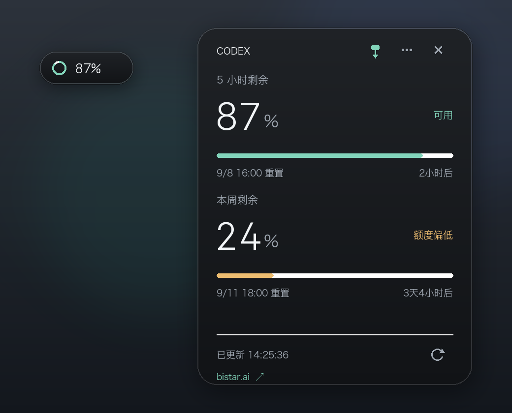

# Codex Quota

中文 · [English](README.en.md)

在 macOS 菜单栏和桌面小窗查看 Codex 剩余额度。



## 环境要求

- Apple Silicon（M 系列）Mac，macOS 26 或更新版本。
- 已安装并登录 Codex，放在系统“应用程序”文件夹中。

## 下载与启动（无需编译）

优先在 [Releases](https://github.com/ccpua/codex-quota/releases) 下载 `Codex-Quota-*-arm64.dmg`：

1. 双击 DMG。
2. 将 **Codex Quota.app** 拖到“应用程序”文件夹。
3. 双击 **Codex Quota** 启动，无需安装 Python 或开发工具。

没有 DMG 时，也可以在仓库页面点击 **Code → Download ZIP**，解压后将其中的 app 拖到“应用程序”文件夹。

当前版本尚未经过苹果公证。如果首次打开被提示无法验证开发者，请确认来自本仓库，再到 **系统设置 → 隐私与安全性 → 仍要打开**。[苹果操作说明](https://support.apple.com/zh-cn/102445)

鼠标悬停胶囊查看详情，拖动可调整位置；右键菜单可检查更新，或设置语言、外观和刷新间隔，也可退出程序。

## 代码变更统计

悬浮卡片展示关联项目的**新增、修改、删除**源代码行数，每 10 秒在后台刷新。

- 自动读取本机 Codex 保存的项目，合并重复仓库，并检查各个 Git worktree。
- 汇总口径为**今日提交 + 当前未提交改动**。未提交内容可能来自更早日期，因此数字不等同于严格的今日编辑量。
- 同一 diff 变更块内，将新增和删除行配对记为“修改”；其余分别计为“新增”和“删除”，三个数量不重复。连续提交对同一行的修改可分别计数。
- 今日按 App 所选时区和 Git 提交者时间计算，统计本机已有分支的非合并提交，不联网拉取远端记录。暂存和未暂存内容合并对比 HEAD，包含未被 Git 忽略的新源代码文件。
- 统计源代码及测试，包含空行、注释；不统计文档、配置、二进制及常见构建、第三方依赖目录。数字包含所有作者和工具的改动，不仅是 Codex 的产出。
- 非 Git 目录或扫描失败时，指标卡片的悬停提示会标记结果不完整；项目列表读取依赖 Codex 的本地存储格式，后续版本变化可能需要适配。

开发验证：构建后运行 `"Codex Quota.app/Contents/MacOS/CodexQuota" --code-activity-test`。使用 `--code-activity-scan` 可只读取一次真实项目统计并退出。

<details>
<summary>可选：从源码安装</summary>

需要 Python 3.8+ 和 Xcode Command Line Tools（运行 `xcode-select --install` 安装）。在项目文件夹中执行：

```sh
zsh build.sh
python3 install.py
open "$HOME/Applications/Codex Quota.app"
```

</details>

[MIT License](LICENSE)
